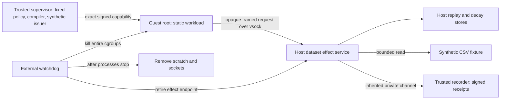

# Linux/KVM isolation experiment

This page describes the original trusted dataset-service configuration. The separate [package-service compromise experiment](PACKAGE_ISOLATION.md) reuses its VM/watchdog machinery but moves the trusted retrieval gate and state outside an explicitly compromised package worker.

The opt-in lab runs the static synthetic workload as PID 1 / UID 0 in an actual Firecracker microVM. It retrieves a bounded CSV fixture through a host-side effect service and computes a byte count and checksum of the returned response. The guest performs no capability verification. A malicious guest can submit arbitrary frames to the service; authorization, replay consumption, decay, and dataset access happen outside the guest.

The selected lab configuration is Ubuntu 24.04, x86_64, KVM, and cgroup v2 with CPU/memory/PID controllers. It was exercised on Ubuntu 24.04.3 under WSL2 kernel `6.6.87.2-microsoft-standard-WSL2`, Firecracker/jailer 1.15.1, and guest kernel 6.1.155 on 2026-09-09. This is a tested nested-KVM development configuration, not upstream production-host certification. The portable process demo remains development-only and is not a fallback for this command.

## Boundaries and authority



| Principal | Authority and accessible state | Workload-accessible interface |
|---|---|---|
| Host supervisor / recorder, root | Capability signing key in memory, fixed fixture policy and compiler, evidence key/chain, artifact measurements, launch and teardown | None; guest receives only a signed exact-request token |
| Effect service, UID/GID 60001 | Session context, public verifier key, bounded synthetic dataset, private replay/decay SQLite files | One vsock-forwarded Unix socket; exact capability plus kernel peer-UID check |
| Jailed Firecracker, UID/GID 60000 | KVM device, kernel, minimal initramfs, one scratch image, one vsock endpoint | No NIC, MMDS, host mount, API socket, or general connector |
| Guest workload, UID 0 | Its own memory, static init and scratch; no host databases or keys | May submit arbitrary bytes to the fixed host effect endpoint |
| External watchdog, root | Exact per-run cgroups, scratch/config/socket paths, private supervisor pipe | None |

One global lock serializes lab sessions. The runner rejects existing accounts or processes using the two reserved UIDs; it does not create users or stop unrelated processes. It is not a concurrent multi-tenant deployment. All host administrators, the hypervisor, host/guest kernels, Windows/WSL management, trusted effect service, supervisor, and recorder remain trusted as appropriate to their roles.

Firecracker uses the matching upstream jailer, a private mount root, default seccomp, an unprivileged identity, a separate network namespace, a 128 MiB guest, and cgroup limits of 256 MiB host memory, 32 tasks, and one CPU quota per service. The effect service also gets its own network namespace, drops supplementary groups and capabilities, enables no-new-privileges, and bounds file sizes/descriptors. Host `/proc` observations verify the VM identity, root, seccomp, lack of effective/permitted capabilities, network namespace, and both cgroup memberships.

The effect service exposes only `object.read` of `synthetic-dataset`, with integer offset/length, at most 512 bytes, and exact signed arguments. It accepts no URL, filesystem path, attestation override, callback, mint, reset, refresh, or evidence-domain selection. Replay and decay mutation occur only as part of validated redemption. Frames use the existing strict 64 KiB protocol with duplicate-key rejection; the single-threaded service limits connections, uses a two-second request alarm and bounded listener backlog, and is subject to the independent watchdog. The capability itself expires. Exhaustion sacrifices availability.

The recorder runs outside both service principals. Only the inherited effect-service channel can append effect/transport events; the supervisor appends host observations and teardown under its own source identity. Neither client chooses an arbitrary evidence domain. The report exports events and Ed25519 receipts, including signatures over the host observations and build-manifest digest. Embedded verification keys prove internal integrity, not independent issuer trust or completeness of observation. The effect service is a trusted evidence source; compromising it is a separate roadmap experiment.

The requested report is marked `INCOMPLETE` at the start of a run and becomes `PASS` only after all three sessions finish. An interrupted run must not be interpreted as either successful containment or proof that no effect occurred; its per-run host records may still exist for investigation.

## Build and reproduce

Linux dependencies: Python 3.11+ and the pinned project dependencies; GCC/static libc, `mkfs.ext4`, `debugfs`, `unshare`, `setpriv`; accessible KVM; and already-enabled cgroup v2 `cpu`, `memory`, `pids` controllers. The launcher needs root to configure the jail and dedicated cgroups, then drops the VM/service identities. It refuses unsupported prerequisites without a fallback.

From the repository on the selected Linux host:

```bash
python3 -m venv /var/tmp/event-horizon-isolation-venv
/var/tmp/event-horizon-isolation-venv/bin/python -m pip install -e .
python3 scripts/prepare_linux_isolation.py
sudo /var/tmp/event-horizon-isolation-venv/bin/python scripts/run_linux_isolation.py run \
  --report artifacts/reports/linux-isolation.json
/var/tmp/event-horizon-isolation-venv/bin/python scripts/verify_linux_isolation.py \
  artifacts/reports/linux-isolation.json
```

For the Windows checkout used in this test, after preparing the Linux environment:

```powershell
wsl -d Ubuntu --exec python3 /mnt/c/dev/event-horizon-harness/scripts/prepare_linux_isolation.py
wsl -d Ubuntu -u root --exec /var/tmp/event-horizon-isolation-venv/bin/python /mnt/c/dev/event-horizon-harness/scripts/run_linux_isolation.py run --report /mnt/c/dev/event-horizon-harness/artifacts/reports/linux-isolation.json
python scripts/verify_linux_isolation.py artifacts/reports/linux-isolation.json
```

The committed asset lock pins archive, binary, and kernel SHA-256 values. The builder verifies downloads and extracts only the expected binary files. It builds a static init into a fixed-metadata newc initramfs with no timestamps. Repeated builds on the tested toolchain produced identical image bytes. This reproducibility scope requires identical source, compiler/static libc, Python and zlib; it is not yet a hermetic toolchain or independent reproducible-build service. The generated manifest records compiler and source identity. Build artifacts are ignored under `firecracker/build/isolation`.

## What the experiment checks

Three real guest-root sessions each perform a successful dataset read and summary. Invalid signatures, absent authority, argument substitution, unsupported network operations, replay, and a prior session's **unredeemed** capability are denied. Host-side SQLite consumption and recorder completion counts must each be exactly one; the test does not rely solely on guest-reported denials. Protocol/range/peer identity and durable restart cases also have portable unit tests.

The guest writes a synthetic scratch marker and starts a child that ignores SIGTERM. Host `debugfs` observes the marker directly before teardown. The watchdog kills the entire effect/VM cgroups on requested stop, deadline, or EOF on its supervisor control pipe; the last case explicitly closes the pipe to exercise the same notification mechanism used on supervisor exit. This is not a claim that an actual supervisor crash was injected. It confirms empty cgroups before removing scratch, configuration, and sockets. The host verifies the retired effect endpoint is unreachable, and the next session starts with fresh scratch and rejects prior authority.

Endpoint retirement is the revocation mechanism in this single-session topology: there is no other configured effect backend and no automatic reuse of session configuration. It does not introduce global cryptographic revocation or safe revival of a retired backend. SQLite state and signed observation artifacts are retained under root-controlled per-run `/var/tmp/ehk-*` directories for investigation; ephemeral guest scratch is truncated/unlinked, not forensically erased from physical storage.

Guest-reported root probes, missing scratch on boot, and a failed unused-vsock-port connection are explicitly diagnostics. Configuration, host process identity/isolation, authoritative file-access denials, effect records, scratch writes, and teardown are observed from outside the guest. The kernel/image fixture establishes that the test intentionally runs guest root; there is no adaptive adversary or exploit-finding campaign.

## Remaining work and attack analysis

The topology closes the direct guest-to-host-state gap in the narrow dataset workflow: guest-local checks can be skipped without granting effects because the trusted host service revalidates the exact token and owns consumption. The guest has no database mount, signing interface, host credential, network interface, or arbitrary effect handler. Both VM and effect principals are denied access to authoritative recorder state. Ambiguous outcomes retain the milestone-1 semantics; missing responses are not evidence of no effect.

This is not a replacement for independent isolation review. The synthetic issuer uses the existing fixture authority context and trusted policy compiler, not production enrollment or the seven-process guardian issuance flow. Hardware attestation remains unimplemented for this lab. There is no external write adapter, distributed replay, multi-session concurrency, multi-host revocation, package service, or arbitrary shell workflow. The effect service runs outside the VM jail and stays trusted; its own compromise, general filesystem visibility, service-mediated relays, and cross-session data exposure require the auxiliary-service work in roadmap milestones 3–4. The host network namespace denies its IP egress but does not establish safety of every possible host IPC surface after service compromise.

Unrestricted guest-kernel exploit campaigns, side/covert channels, firmware attacks, host/administrator compromise, physical data remanence, all crash/storage fault windows, and continuous production operation are untested. Guest root may destroy its own scratch or hang; the independent watchdog bounds the run and retires external authority. Output remains untrusted, and signed evidence does not establish absence of every unauthorized effect.

Implementation references: [Firecracker jailer 1.15.1](https://github.com/firecracker-microvm/firecracker/blob/v1.15.1/docs/jailer.md), [vsock forwarding semantics](https://github.com/firecracker-microvm/firecracker/blob/v1.15.1/docs/vsock.md), and [the pinned upstream release](https://github.com/firecracker-microvm/firecracker/releases/tag/v1.15.1).
